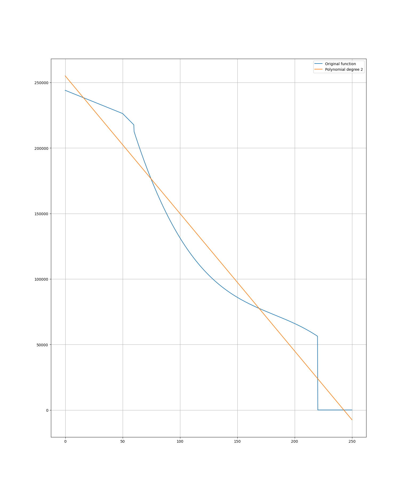
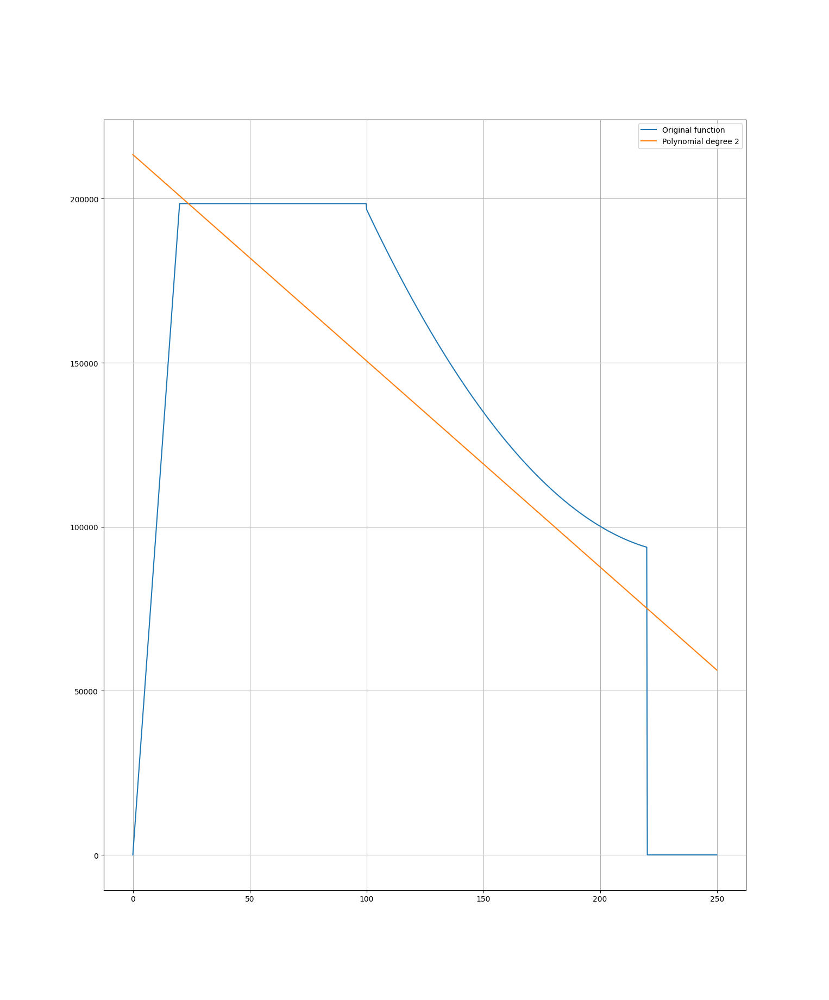
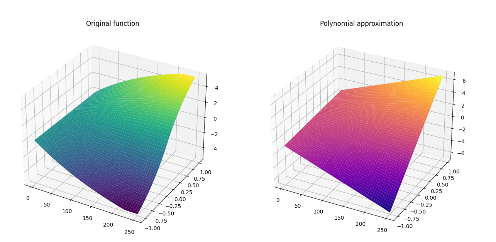

# Initial formulation of Alstom Problem

## Variables:
We have $N$ decision steps, therefore, we have $\forall i \in [0,N-1]$
- Speeds: $(v_i)_i \in \mathcal{R}$
- Decisions: $(Dec_i)_i \in [-1;1]$ 
- Useful variables: $(\delta_i)_i \in \mathcal{B}$ 

## Cost function:
The cost or energy used is: $C = \sum_{i=0}^{N-1} C_i$,  where:
$$C_i = f(v_i,Dec_i) = \frac{P_{max}}{C_{max}} \Delta t \ (1-exp(\frac{-v_i}{v_{max} + 0.001})) \ (tanh(100 \ Dec_i)) \ (1-exp(\frac{-Dec_i}{Dec_{max} + 0.00001}))   $$

## Constraints:

### Speed constrained by acceleration:

- $v_0=0$
- $v_{N-1}=0$
- $\forall i \in [1,N-2] : v_{i+1} = v{i} + \gamma \Delta t $, where $\gamma = \gamma (v_i,Dec_i)$

#### Determining the $\gamma_i$:

We have $F_+$ and $F_-$ the acceleration and braking forces respectively, where:
- $F_+ (v_i) = \begin{cases} -354.1 \ v_i + 2.44 \times 10^5 \ \ \ \ \ \text{     if  } v_i \in [0;50] \ kph \\ -881.3 \ v_i + 2.704 \times 10^5 \ \ \ \ \  \text{  if  } v_i \in [50;60] \ kph \\ -0.05265 \ v_i^3 + 28.78 \ v_i^2 - 5603 \ v_i + 4.566 \times 10^ 5 \ \ \ \ \  \text{  if  } v_i \in [60;220] \ kph \\ \end{cases}$

- $F_- (v_i) = \begin{cases} 9925 \ v_i + 1.243 \ \ \ \ \ \text{     if  } v_i \in [0;20] \ kph \\ 2.039 \times 10^{-13} \ v_i + 1.985 \times 10^5 \ \ \ \ \  \text{  if  } v_i \in [20;100] \ kph \\ 5.389 \ v_i^2 - 2583 \ v_i + 4.012 \times 10^ 5 \ \ \ \ \  \text{  if  } v_i \in [60;220] \ kph \\ \end{cases}$

We use the $\delta_i$ variable to determine whether or not we are accelerating, $\delta_i = \begin{cases} 1 \ if \ Dec_i \ge 0 \\ 0 \ otherwise\end{cases} $

The force applied at time step $i$ is:
$$F_i = Dec_i (\delta_i \ F_+(v_i) + (\delta_i-1)F_-(v_i))$$
But this is the force applied at the wheels, not the acceleration force, we have:
$$ F_i = RAV_i + \frac{M_s g}{1000} (\alpha + \frac{800}{\rho}) + kM_s \gamma_i $$
Where:
- $\gamma_i$ the residual acceleration
- $k$ the coefficient to consider the rotating mass of the train
- $\alpha$ the angle of the track
- $\frac{800}{\rho}$ the term corresponding to the curvature of the track
- $RAV_i$ the resistance to advancement of the train

We have:
$$ RAV_i = A + B v_i + C v_i^2 $$
Where $A,B,C$ constants

We consider the track is perfectly straight and horizontal, therefore:
$$ \gamma_i = (\frac{Dec_i (\delta_i \ F_+(v_i) + (\delta_i-1)F_-(v_i)) - (A + B v_i + C v_i^2 )}{k M_s})$$

### Constraining useful variable $(\delta_i)_i$:

We need to constrain the $\delta_i$, we use the big M method, therefore, with $M=1$ and $\epsilon = 10^{-4}$; $\forall i$:
- $\epsilon - M(1-\delta_i) \le Dec_i$
- $M \delta_i \ge Dec_i $

### Distance constraint:

We have $D$ the distance to travel, therefore, with $D_j = \Delta t \sum_{i=0}^j v_i  $, this gives us:
$$\Delta t \sum_{i=0}^{N-1} v_i \approx D$$

## Bounds:
We have, $\forall i$:
- $v_i \in [0,v_{max}]$
- $Dec_i \in [-1,1]$
- $\delta_i \in \mathcal{B}$

# Adaptations:
However, we are unable to use complex functions as constraints or cost functions, we therefore try to approximate them using polynomials.

## Traction functions
For these traction functions, the approximation is quite straightforward. Remember, we have:
$$ \gamma_i = \frac{Dec_i (\delta_i \ F_+(v_i) + (\delta_i-1)F_-(v_i)) - (A + B v_i + C v_i^2 )}{k M_s} = \text{Cst } \times [\delta_i P_{F_+}(v_i) + (\delta_i-1) P_{F_-}(v_i) - P_{RAV}(v_i)] $$
Where the $P_i \in \mathcal{R}_3[X]$. 
All that we have to do is approximate these polynomials with a second degree polynomial (maximum accepted by DWave). For this we use the least squares method to find the coefficients of our polynomial.
#### $P_{F_+}$:
For $F_+$ we use a first degree polynomial to fit our function this gives us:

#### $F_-$:
For $F_-$ we also use a first degree polynomial to fit our function this gives us:

#### How about $\gamma_i$ ?

We therefore have an approximated definition of $\gamma_i$:
$$ \gamma_i = Cst \times [P_F (v_i,D_i) - P_{RAV}(v_i)] $$
Where:
- $P_F$ is of the form: $P_F(X,Y) = a X + b Y + c XY $ which is accepted by DWave
- $P_{RAV} \in \mathcal{R}_2[X]$ 

## Cost function:

We create a Polynomial approximation of the cost function, for this we also use the least squares method with a Vandermonde Matrix. We use it to determine a polynomial of the form:
$$ P_{cost}(X,Y) = a X + b Y + c XY $$

The rest of the previously defined formulation remains the same.