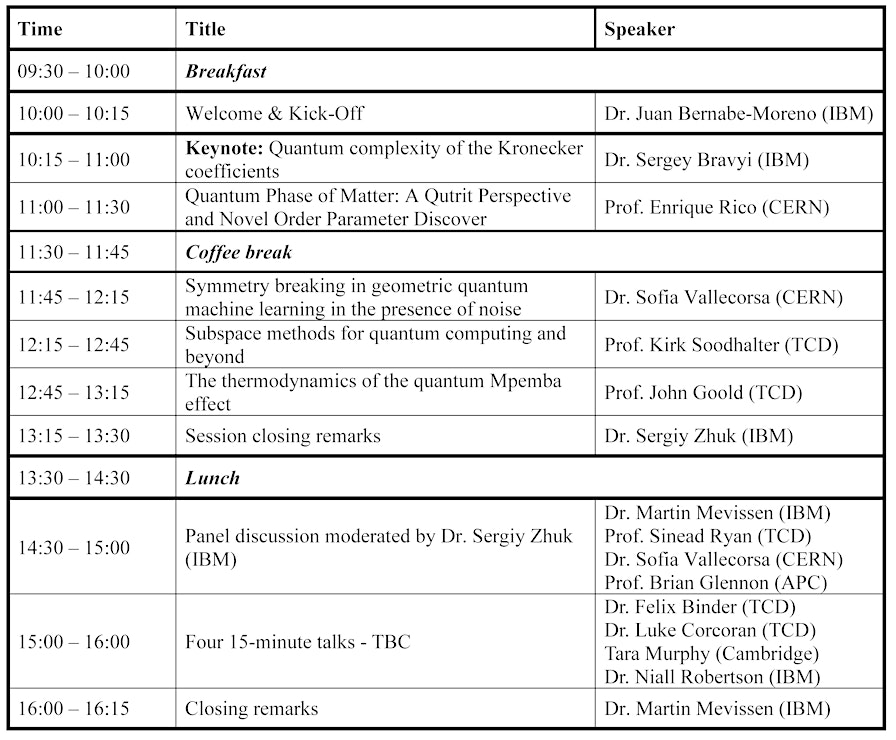

# IBM Workshop November 1 2024

## First Talk (Sergey Bravyi (IBM))
**Advantage of quantum computation vs. classical computation**

Idea of deep/shallow circuit
- Recursive QAOA (RQAOA):
  - Remove some of the nodes
  - Better than QAOA bc global solving view, not local

**Look at that for project, surpassing the problem of local maxs**

## Second Talk (Enrique Rico)
More about quantum physics...

## Third Talk (John Goold TCD)
**Thermodynamics of the quantum Mpemba effect**

### Generalities and History

Mpemba effect : hot water can freeze colder than cold water
- Violates Newton's law of cooling
- Still isn't really explained

Why does it matter in quantum ?
- Idea of forcing a state that has derived (unsymetric for quantum) back to its original state (symmetrical state)
  - Sometimes, if it is further derived, it can get back to initial state faster than less derived states
  - We can therefore speed up this correction
  
Liouvillian ?

**ASK FOR SLIDES**
Trinity Quantum Alliance

## Fourth Talk (Sofia Vallecorsa)
**Symmetry breaking in geometric quantum machine learning in the presence of noise**
