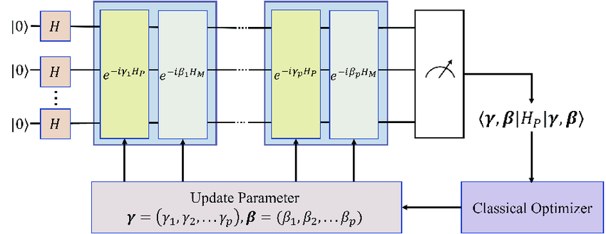

# Mathematical formulation

## Formulating our optimization problem

### Variables:

Nc binaries $x[i]$ where $x[i]=1$ when we are accelerating at time segment i

Nc binaries $y[i]$ where $y[i]=1$ when we are braking at time segment i

Nc binaries $z[i]$ used to linearize constraint

### Objective function:

We consider that the energy cost from accelerating is worth $(\Delta v)^2$ where $\Delta v$ is our train's acceleration during a time segment.

We consider that the energy we get back from regenerative braking is worth: $\alpha (\Delta v)^2$ where $\alpha$ is the efficiency.

Therefore, our objective function is:
$$Objective(N_c) = \sum_{i \in [0,N_c]} (x[i]  - y[i] \alpha) (\Delta v)^2  $$

### Constraints:

#### Constraint 1: Simultaneous braking/acceleration

We want to force our train to be either accelerating or braking, to do this we want to impose the constraint:
$$\forall i \in [0,N_c] \ , \ x[i] \times y[i] = 0 $$
However, this constraint formulation is quadratic and non-convex, we will therefore linearize it.

Generally, if we want to deal with constraining $z=xy$ where $x$ is binary and $y$ is bounded ($L \le y \le U$), we can create a variable $z$ and add the constraints:
- $z \le Ux$
- $z \ge Lx$
- $z \le y-L(1-x)$
- $z \ge y - U(1-x)$ 
  
And then constraint $z$.

In our case, $L=0$ and $U=1$, therefore we add the constraints:
$\forall i \in [0,Nc]:$
- $z[i] \le x[i]$
- $z[i] \ge 0$
- $z[i] \le y[i]$
- $z[i] \ge x[i] + y[i] - 1$

We can remove the second constraint, $z[i]$ being binary.

#### Constraint 2: Total Distance constraints

##### Method 1:
We want our train to travel a distance $D \pm tol $.

For each step, we define the velocity at step $j$ as being:
$$ v_j = \sum_{i=0}^j (x[i]-y[i])(\Delta v) $$

And the final distance as being:
$$ D_{travelled} = \sum_{i=0}^{N_c-1} v_i $$

We therefore add the constraints:

- $ \sum_{i=0}^{N_c-1} v_i \le D+tol  $
- $ \sum_{i=0}^{N_c-1} v_i \ge D-tol  $

We can simplify this contraint, in reality, it is:
$$ \Delta v \sum_{j=0}^{N_c-1} \sum_{i=0}^j (x[i]-y[i]) = \Delta v \sum_{i=0}^{N_c-1} (N_c - i) (x[i]-y[i]) $$

##### Method 2: Trapeze

Let $D_{i}$ be the distance travelled during $[i,i+1]$:
We have:
$$ D_{i} = 1 \times (v_i + \frac{1}{2} \Delta v (x_i-y_i) )    $$

Therefore:
$$ D_{travelled} = \sum_{i=0}^{N_c-1} (v_i + \frac12 \Delta v (x_i-y_i)) = \Delta v [\sum_{i=0}^{N_c-1} \sum_{j=0}^{i} (x_j-y_j) + \frac12 \sum_{i=0}^{N_c-1} (x_i-y_i)] $$

We have:
$$\sum_{i=0}^{N_c-1} \sum_{j=0}^{i} (x_j-y_j) = \sum_{i=0}^{N_c -1} (N_c - i)(x_i-y_i) \ \ \ \ cf. \ previous \ constraint $$

Therefore:
$$ D_{travelled} = \Delta v \sum_{i=0}^{N_c-1} (x_i-y_i)(N_c - i + \frac12)    $$
Or if $\Delta v_{acc} \ne \Delta v_{decc}$:
$$ D_{travelled} = \Delta v _{acc} \sum_{i=0}^{N_c-1} x_i \ (N_c - i + \frac12) - \Delta v_{decc} \sum_{i=0}^{N_c-1} y_i \ (N_c - i + \frac12)    $$
We then add a constraint on $D_{travelled}$

#### Constraint 3: Net-Zero constraint

We also want our train to be stopped when arriving, therefore, we add the constraint:
- $ v_{N_c}= \sum_{i=0}^{N_c} (x[i]-y[i])(\Delta v) = 0$

#### Constraint 4: Maximum speed constraint

We want our train's maximum speed to be $v_{max}$, for this we add the constraints:
$\forall i \in [0,N_c]:$
- $v_i \le v_{max}  $

We can simplify this constraint, because we don't have different speed limits on our track. We therefore only add the constraint:
- $ \sum_{i=0}^{N_c} x[i] \ \Delta v \le v_{max} $
  
This works because the optimal trajectory will try to reach the maximum speed and then start braking for arrival.

#### Constraint 5: Positive speed constraint

We want to force our speed to remain positive, for this we add the constraint:
$\forall i \in [0,N_c]:$
- $v_i \ge 0  $

## Converting our problem

### Converting inequalities to equalities

In order to convert our inequalities to equalities, we introduce slack variables:

An inequality $x \ge y$ therefore becomes $x + s = y$ by introducing a slack variable $s \ge 0$.

An inequalities $x \ge y$ therefore becomes $x + s =y$ by introducing a slack variable $s \le 0$.

We, however do not need to do this as the QUBO conversion takes care of both types of constraints.

### Converting our problem to a Quadratic Unconstrained Binary Optimization (QUBO) problem

In order to run our optimization problem on quantum hardware, we have to input an unconstrained problem. For this, we will convert our constraints (equality) to penalties.

We can write all of our constraints as : 
$$ h(x,y,z) = \sum_{i=0}^{N_c} (a_i x[i] + b_i y[i] + c_i y[i]) - b =0  $$

We define a penalty term and add it to the objective function: 
$$ Penalty= \lambda (h(x,y,z))^2 $$
By default, $\lambda$ is defined by $ \lambda = 10 \times max(\text{absolute coefficient in objective function})  $

We therefore apply this to all of our constraints and our problem becomes unconstrained.

Once all of our constraints are transformed to penalties, we are left with a QUBO problem of the form:
$$ minimize:  \ x^T Q x = \sum_{i,j=1}^n Q_{i,j} x_i x_j  $$

### Converting our QUBO problem to an Ising Hamiltonian

From this QUBO, we will need to extract the Ising Hamiltonian which is done by applying the transformation: $x \rightarrow \frac{\sigma + 1}{2} $. Where the $x[i]$ binary variables are turned to spin variables $\in \{ -1,+1 \}$

The Ising Hamiltonian is defined as: 
 $$ H(\sigma) = \sum_{i,j} J_{i,j} \sigma_i \sigma_j + \sum_i h_i \sigma_i  $$

Where:
- $ h_i = - \frac{1}{2} \sum_j Q_{i,j} - \frac{Q_{i,i}}{2}  $
- $ J_{i,j} = \frac{Q_{i,j}}{4}  $
- $ offset = \frac{1}{4} \sum_{i,j} Q_{i,j}  $

We are therefore left with the Ising Hamiltonian and offset.

## QAOA

We build a parametrized quantum circuit that we will optimize in order to solve our problem.

#### Cost Hamiltonian

We apply the Hamiltonian as a phase evolution: 
$$ U_C (\gamma) = e^{-i \gamma H_C} = \prod_i e^{-i \gamma h_i \sigma_i} \prod_{i \lt j} e^{-i \gamma J_{i,j} \sigma_i \sigma_j}  $$
From the Ising Hamiltonian's definition. This means that each qubit undergoes single-qubit $R_Z$ rotations and two-qubit $ZZ$ interactions.

- $ e^{-i \gamma h_i \sigma_i} $ corresponds to rotating qubit i by an angle of $ \gamma h_i $ around Z.
- $ e^{-i \gamma J_{i,j} \sigma_i \sigma_j} $ corresponds to a two-qubit rotation based on the value of $J_{i,j}$

#### Mix Hamiltonian

We apply a mixing term to encourage the exploration of the solution space, usually:
$$ H_m = \sum_i X_i  $$

The corresponding unitary:
$$ U_M(\beta) = e^{-i \beta H_M} = \prod_i e^{-i \beta X_i}  $$
These are single-qubit $R_X$ rotations.

#### Building the circuit

We start by intializing all qubits to the state: $ \ket{+} = \frac{\ket{0} + \ket{1}}{\sqrt{2}} $
By applying a Hadamard gate to all qubits, this gives us:
$$ \ket{+}^{\otimes n} = \frac{1}{\sqrt{2^n}} \sum_z \ket{z}  $$

We then apply the cost Hamiltonian $U_C(\gamma)$ followed by the mixer Hamiltonian $U_M(\beta)$

We do this p times for p the number of layers which also corresponds to the amount of circuit parameters we are going to optimize.
Therefore, we have:
$$ \ket{\psi(\gamma,\beta)} = \prod_{j=1}^p (U_M (\beta_j) \ U_C(\gamma_j)) \ \ket{+}^{\otimes n}  $$

At the end, we measure the final quantum state in the computational basis. We do this multiple times to find an average value. This gives us the expected value of the cost Hamiltonian.

We then try to optimize classically $\beta \ and \ \gamma$ in order to minimize:

$$ \braket{H_C} =  \ket{\psi(\gamma,\beta)} H_C \bra{\psi(\gamma,\beta)} $$

This creates a loop represented by the diagram below.

Once we've optimized the circuit's parameters, we create the optimized circuit and run it multiple times which gives us our optimal solution.