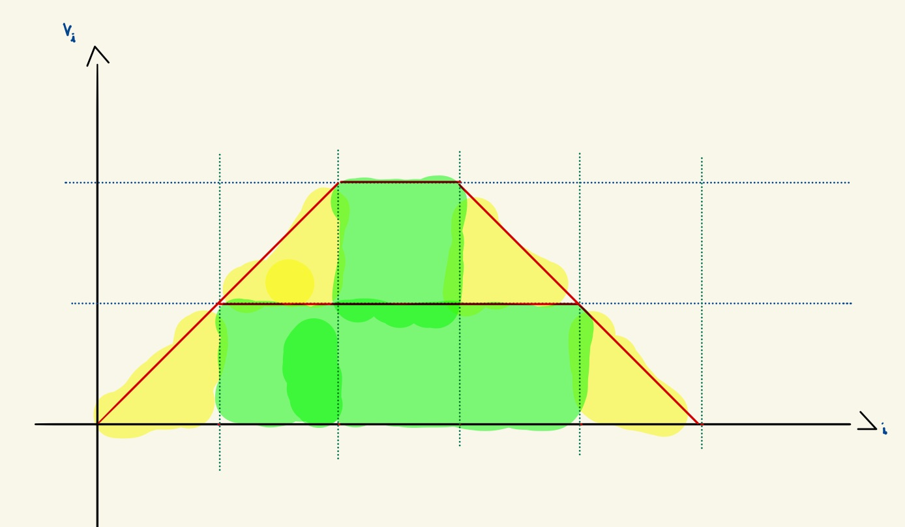
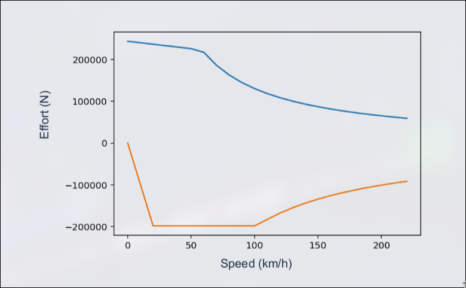
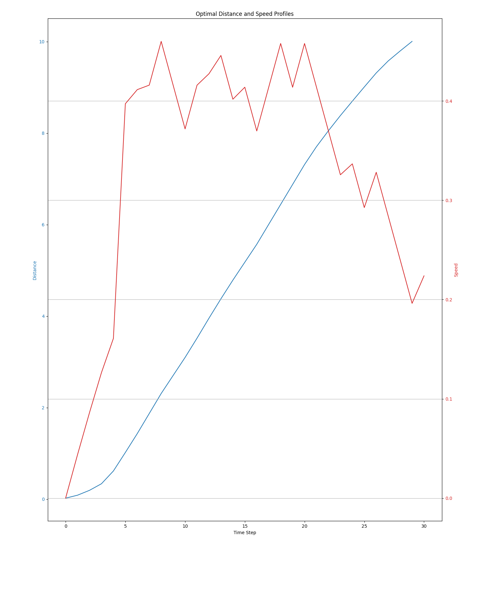

# Binary formulation

## Formulating our optimization problem

### Problem definition

The objective of the problem is to minimize the amount of energy used by a train to go from point A to point B. In order to do this we must figure out the optimal time when the train should be accelerating, coasting or braking.

### Defining a solution
We must firstly start by discretising our problem. We cut up our time interval  into $N_c$ pieces. We then consider our three possible states for each step encoded into two bits $x_i \ y_i$, where:

```math

v_{i+1} = 
\begin{cases} 
v_i & \text{if }  x_i \ y_i=00 \\
v_i + \Delta v & \text{if }  x_i \ y_i =10 \\
v_i - \Delta v & \text{if }  x_i \ y_i =01 \\
v_i & \text{if }  x_i \ y_i =11 \\
\end{cases}
```
Where $\Delta v = v_{i+1}-v_i \ \forall i$ 

We therefore consider a system with $N_c$ discrete time-steps the $i^{th}$ time step having a corresponding two-bit decision variable $x_{i}$;$y_{i}$. 

 We consider a solution being an  $xy\in \left\{00,01,10,11\right\} ^N$

### Variables:

Nc binaries $x_i$ where $x_i=1$ when we are accelerating at time segment i

Nc binaries $y_i$ where $y_i=1$ when we are braking at time segment i

Nc binaries $z_i$ used to linearize a constraint

### Cost function:

#### Constant energy model:
We use a constant energy model, which supposes that the energy needed to go from one speed to another is always constant. We also consider that the efficiency $\eta$ is proportional to the ratio of the average velocity (between initial and final speed) up to a constant C, ie. $\eta =C \times \frac{v_{avg,i}}{\Delta v_i}$.
And with:
```math
E_{i+1} = \frac{1}{2 \eta}  (v_{i+1}^2 - v_i^2) = \frac{1}{\eta} \Delta v_i \ v_{avg,i}
```

We consider that the energy cost from accelerating is worth $(\Delta v)^2$ where $\Delta v$ is our train's acceleration during a time segment.

We consider that the energy we get back from regenerative braking is worth: $\alpha (\Delta v)^2$ where $\alpha$ is the efficiency.

Therefore, our objective function is:
$$Objective(N_c) = \sum_{i \in [0,N_c]} (x_i  - y_i \alpha) (\Delta v)^2  $$

#### Efficiency function:

We introduce an efficiency function $\eta$ that will represent the electrical efficiency of a train. We model $\eta$ as a step-wise approximate function, where at step $i$:
$$ \eta_i = \eta_0 - \Delta \eta \sum_{j=0}^i (x_j-y_j) \in [0;1]   $$
Where, $\eta_0$ is the baseline efficiency and $\Delta\eta$ represents the efficiency change per velocity increment. Here have $-\Delta \eta \sum ...$ because as the efficiency increases, our cost should decrease.

Remember, we have:
$$E_i={\eta}_i \ \Delta v_i \ v_{avg,i}$$
Here, our effiency $\eta$ is at the numerator as it is a decreasing function. By supposing that $v_{avg,i} \approx v_i$ and that $\forall i: \ \Delta v_i = \Delta v$, we get:
$$E_i = \eta_i \ \Delta v \ v_i = (\eta_0 - \Delta \eta \sum_{j=0}^i (x_j-y_j))\Delta v (\sum_{j=0}^i (x_j-y_j)\Delta v)  $$
Therefore:

$$ Objective(N_c) = \sum_{i=0}^{N_c} E_i = \Delta v^2 [(\eta_0 \sum_{i=0}^{N_c}  \sum_{j=0}^{i} (x_j-y_j)) - (\Delta \eta \sum_{i=0}^{N_c} (\sum_{j=0}^{i} (x_j-y_j))^2)]     $$
We can simplify this into:
$$ Objective(N_c) = \Delta v^2 [(\eta_0\sum_{i=0}^{N_c} (N-i)(x_i-y_i)) - (\Delta \eta \sum_{i=0}^{N_c} (\sum_{j=0}^{i} (x_j-y_j))^2) ] = \Delta v [O_{lin}(N_c) + O_{quad}(N_c)]    $$

### Constraints:

#### Constraint 1: Simultaneous braking/acceleration

We want to force our train to be either accelerating or braking, to do this we want to impose the constraint:
$$\forall i \in [0,N_c] \ , \ x_i \times y_i = 0 $$
However, this constraint formulation is quadratic and non-convex, we will therefore linearize it.

Generally, if we want to deal with constraining $z=xy$ where $x$ is binary and $y$ is bounded ($L \le y \le U$), we can create a variable $z$ and add the constraints:
- $z \le Ux$
- $z \ge Lx$
- $z \le y-L(1-x)$
- $z \ge y - U(1-x)$ 
  
And then constraint $z$.

In our case, $L=0$ and $U=1$, therefore we add the constraints:
$\forall i \in [0,Nc]:$
- $z_i \le x_i$
- $z_i \ge 0$
- $z_i \le y_i$
- $z_i \ge x_i + y_i - 1$

We can remove the second constraint, $z_i$ being binary.

#### Constraint 2: Total Distance constraints

##### Method 1:
We want our train to travel a distance $D \pm tol $.

For each step, we define the velocity at step $j$ as being:
$$ v_j = \sum_{i=0}^j (x_i-y_i)(\Delta v) $$

And the final distance as being:
$$ D_{travelled} = \sum_{i=0}^{N_c-1} v_i $$

We therefore add the constraints:

- $ \sum_{i=0}^{N_c-1} v_i \le D+tol  $
- $ \sum_{i=0}^{N_c-1} v_i \ge D-tol  $

We can simplify this contraint, in reality, it is:
$$ \Delta v \sum_{j=0}^{N_c-1} \sum_{i=0}^j (x_i-y_i) = \Delta v \sum_{i=0}^{N_c-1} (N_c - i) (x_i-y_i) $$

##### Method 2: Trapeze


Let $D_{i}$ be the distance travelled during $[i,i+1]$:
We have:
$$ D_{i} = 1 \times (v_i + \frac{1}{2} \Delta v (x_i-y_i) )    $$

Therefore:
$$ D_{travelled} = \sum_{i=0}^{N_c-1} (v_i + \frac12 \Delta v (x_i-y_i)) = \Delta v [\sum_{i=0}^{N_c-1} \sum_{j=0}^{i} (x_j-y_j) + \frac12 \sum_{i=0}^{N_c-1} (x_i-y_i)] $$

We have:
$$\sum_{i=0}^{N_c-1} \sum_{j=0}^{i} (x_j-y_j) = \sum_{i=0}^{N_c -1} (N_c - i)(x_i-y_i) \ \ \ \ cf. \ previous \ constraint $$

Therefore:
$$ D_{travelled} = \Delta v \sum_{i=0}^{N_c-1} (x_i-y_i)(N_c - i + \frac12)    $$
Or if $\Delta v_{acc} \ne \Delta v_{decc}$:
$$ D_{travelled} = \Delta v _{acc} \sum_{i=0}^{N_c-1} x_i \ (N_c - i + \frac12) - \Delta v_{decc} \sum_{i=0}^{N_c-1} y_i \ (N_c - i + \frac12)    $$
We then add a constraint on $D_{travelled}$

#### Constraint 3: Net-Zero constraint

We also want our train to be stopped when arriving, therefore, we add the constraint:
- $ v_{N_c}= \sum_{i=0}^{N_c} (x_i-y_i)(\Delta v) = 0$

#### Constraint 4: Maximum speed constraint

We want our train's maximum speed to be $v_{max}$, for this we add the constraints:
$\forall i \in [0,N_c]:$
- $v_i \le v_{max}  $

We can simplify this constraint, because we don't have different speed limits on our track. We therefore only add the constraint:
- $ \sum_{i=0}^{N_c} x_i \ \Delta v \le v_{max} $
  
This works because the optimal trajectory will try to reach the maximum speed and then start braking for arrival.

#### Constraint 5: Positive speed constraint

We want to force our speed to remain positive, for this we add the constraint:
$\forall i \in [0,N_c]:$
- $v_i \ge 0  $

## Converting our problem

### Converting inequalities to equalities

In order to convert our inequalities to equalities, we introduce slack variables:

An inequality $x \ge y$ therefore becomes $x + s = y$ by introducing a slack variable $s \ge 0$.

An inequalities $x \ge y$ therefore becomes $x + s =y$ by introducing a slack variable $s \le 0$.

We, however do not need to do this as the QUBO conversion takes care of both types of constraints.

### Converting our problem to a Quadratic Unconstrained Binary Optimization (QUBO) problem

In order to run our optimization problem on quantum hardware, we have to input an unconstrained problem. For this, we will convert our constraints (equality) to penalties.

We can write all of our constraints as : 
$$ h(x,y,z) = \sum_{i=0}^{N_c} (a_i x_i + b_i y_i + c_i y_i) - b =0  $$

We define a penalty term and add it to the objective function: 
$$ Penalty= \lambda (h(x,y,z))^2 $$
By default, $\lambda$ is defined by $ \lambda = 10 \times max(\text{absolute coefficient in objective function})  $

We therefore apply this to all of our constraints and our problem becomes unconstrained.
\sum_0^{N_c}
### Converting our QUBO problem to an Ising Hamiltonian

From this QUBO, we will need to extract the Ising Hamiltonian which is done by applying the transformation: $x \rightarrow \frac{\sigma + 1}{2} $. Where the $x_i$ binary variables are turned to spin variables $\in \{ -1,+1 \}$

The Ising Hamiltonian is defined as: 
 $$ H(\sigma) = \sum_{i,j} J_{i,j} \sigma_i \sigma_j + \sum_i h_i \sigma_i  $$

Where:
- $ h_i = - \frac{1}{2} \sum_j Q_{i,j} - \frac{Q_{i,i}}{2}  $
- $ J_{i,j} = \frac{Q_{i,j}}{4}  $
- $ offset = \frac{1}{4} \sum_{i,j} Q_{i,j}  $

We are therefore left with the Ising Hamiltonian and offset.

## QAOA

We build a parametrized quantum circuit that we will optimize in order to solve our problem.

#### Cost Hamiltonian

We apply the Hamiltonian as a phase evolution: 
$$ U_C (\gamma) = e^{-i \gamma H_C} = \prod_i e^{-i \gamma h_i \sigma_i} \prod_{i \lt j} e^{-i \gamma J_{i,j} \sigma_i \sigma_j}  $$
From the Ising Hamiltonian's definition. This means that each qubit undergoes single-qubit $R_Z$ rotations and two-qubit $ZZ$ interactions.

- $ e^{-i \gamma h_i \sigma_i} $ corresponds to rotating qubit i by an angle of $ \gamma h_i $ around Z.
- $ e^{-i \gamma J_{i,j} \sigma_i \sigma_j} $ corresponds to a two-qubit rotation based on the value of $J_{i,j}$

#### Mix Hamiltonian

We apply a mixing term to encourage the exploration of the solution space, usually:
$$ H_m = \sum_i X_i  $$

The corresponding unitary:
$$ U_M(\beta) = e^{-i \beta H_M} = \prod_i e^{-i \beta X_i}  $$
These are single-qubit $R_X$ rotations.


#### Building the circuit

We start by intializing all qubits to the state: $ \ket{+} = \frac{\ket{0} + \ket{1}}{\sqrt{2}} $
By applying a Hadamard gate to all qubits, this gives us:
$$ \ket{+}^{\otimes n} = \frac{1}{\sqrt{2^n}} \sum_z \ket{z}  $$

### Problem definition

We now move away from binary variables towards integer variables that will be able to represent a stronger or weaker acceleration/deceleration of our train.

Once again we start by descritising our time space into $N_c$ time steps. For every step $i$ we must find an integer $x_i \in [-1;1]$ which corresponds to the demand of the conductor.
```math
Where:\begin{cases}
x_i \le 0 \text{ corresponds to the conductor braking with a force of } x_i \times max(F_B(v_i)) \\
x_i \ge 0 \text{ corresponds to the conductor accelerating with a force of } x_i \times max(F_T(v_i))
\end{cases}
```
That minimizes the total power consumption of the train along its journey.

### Modelising the acceleration/braking force

In order to modelize the maximum braking and acceleration forces of the train at a certain speed, we will use the tables given by Alstom and approximate them by polynomials. We have:


Which we approximate by:
```math
max(F_T(v)) = \begin{cases}
-354.1 v + 2.44e+5 \ \ \ if \ v \in [0;50] \ kph \\
-881.3 v + 2.704e+5 \ \ \ if \ v \in [50;60] \ kph \\
-0.05265 v^3 + 28.78 v^2 - 5603 v + 4.566e+5 \ \ \ if \ v \in [60;220] \ kph
\end{cases}
```


```math
max(F_B(v)) = \begin{cases}
9925 v + 1.243 \ \ \ if \ v \in [0;20] \ kph \\
2.039e-13 v + 1.985e+5 \ \ \ if \ v \in [20;100] \ kph \\
5.389 v^2 - 2583 v + 4.012e+5 \ \ \ if \ v \in [100;220] \ kph 
\end{cases}
```
We then multiply these maximum forces by the demand to find our applied force.

### Modelising the acceleration

We now have the force applied to the rails of the train but must now figure out the acceleration of our train.

We now apply **the fundamental law of train dynamics:**
```math
F_{wheel} = F_{resistance} + F_{weight} + F_{curves} + F_{acceleration}
```
And
```math
F_{wheel} = RAV + \frac{M_sg}{1000}i + \frac{M_sg}{1000} \frac{800}{\rho} + F_{acceleration}
```
For now, we will suppose that:
- The track is perfectly straight and flat, not taking into consideration the loss from the curvature of the track and weight of the train.
- The departure and arrival points are at the same altitude, ignoring the potential energy losses.

We therefore have:
$$ F_{wheel} = RAV + F_{acceleration}$$

```math
Where: \begin{cases} RAV = A v^2 + B v + C \\
F_{acceleration} = M_s \ k \ \gamma \ \text{ , where: } \begin{cases} k: \text{ a coefficient representing the rotation mass} \\ \gamma: \text{the acceleration in } m/s^2 \end{cases}
\end{cases}
```
We therefore have, for acceleration: ${F_{i}} = x_i \times max(F_T(v_i))  = RAV +F_{acceleration}$. Which gives us:
$$ \gamma_i = \frac{x_i \times max(F_T(v_i)) - Av_i^2 - Bv_i - C}{k M_s}   $$

In the same way, for braking:
$$ \gamma_i = \frac{x_i \times max(F_B(v_i)) + Av_i^2 + Bv_i + C}{k M_s}   $$

And: $v_{i+1} = v_i + \gamma_i \Delta T$

In order to enforce our speed limit, we write: $v_{i+1} = min(v_{max} \ , \ v_i + \gamma_i \Delta T)$
### Cost function

In order to modelize the cost function or energy consumption, we once again, use Alstom's $C(demand,V)$ table. We then build a function to approximate these tables. We end up with:

$$ C = \frac{P_{max}}{max(C)} (1-e^{\frac{V}{max(V) + 0.001}}) \times tanh(100 \ demand) \times (1-e^{\frac{|demand|}{max(demand) + 0.001}  }) $$

### Constraints

#### Distance constraint

We want the train to have travelled a specific distance D after its $N_c$ time steps. We have:
$$ D = \sum_0^{N_c} D_i = \Delta T \sum_0^{N_c} (v_i + \frac{\gamma_i}{2}) $$

#### Net-zero constraint

We want our train to be stopped, so at a speed of 0 on arrival.

This means $v_{N_c} = 0$ which we can also write as: $\sum_i^{N_c} \gamma_i = 0$ since our time step length is constant.

### First results

