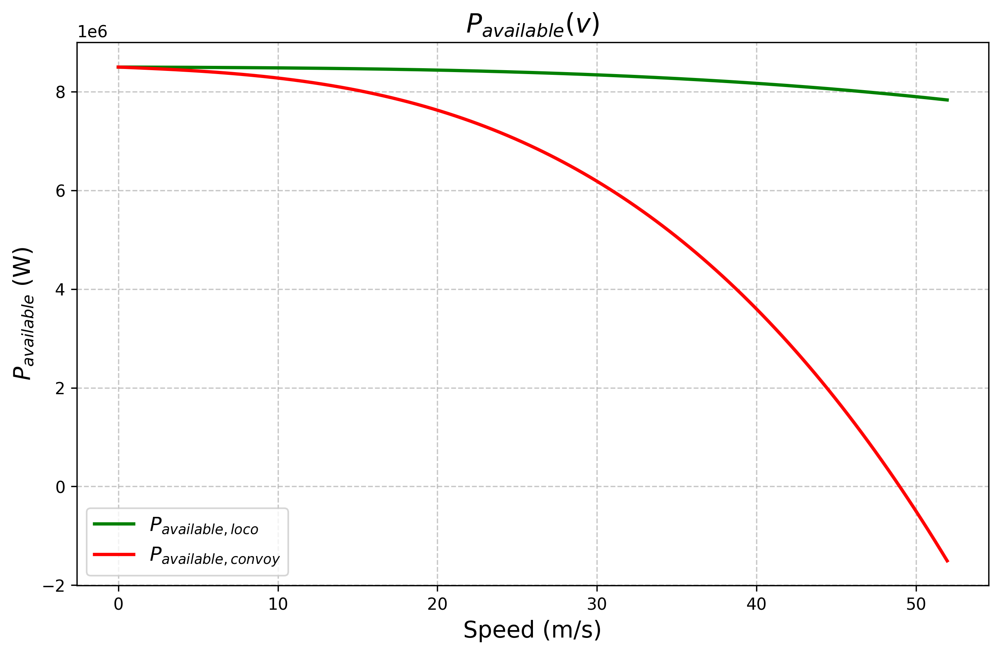

# Modeling a train's acceleration
We are trying to model the $\Delta v(v)$ or acceleration(v) of a train as approximating it as a constant is unreasonable.

## Train dynamics:

### **The fundamental law of train dynamics:**
```math
F_{wheel} = F_{resistance} + F_{weight} + F_{curves} + F_{acceleration}
```
```math
F_{wheel} = RAV + \frac{M_sg}{1000}i + \frac{M_sg}{1000} \frac{800}{\rho} 
```
For now, we will suppose that:
- The track is perfectly straight and flat, not taking into consideration the loss from the curvature of the track and weight of the train.
- The departure and arrival points are at the same altitude, ignoring the potential energy losses.

We therefore have:
$$ F_{wheel} = RAV

### **The RAV losses:**

#### Formula:

We have:
$RAV=A+BV+CV^2$

**A:**
Mesures  the rolling resistance of the wheels on the rail and the axle bearings.
$$A=\lambda_A \sqrt{\frac{10}{m}} M_s$$
where:
- m is the mass per axle
  
**B:**
Other resistance such as losses by mechanical hysteresis, friction of the flanges on the lateral faces of the rail heads etc.
$$B= \lambda_B M_s$$

**C:**
The aerodynamic losses:
$$C= K_1 S + K_2 p L + \sum C_{others}$$
Where:
- $K_1$ global parameter of the shape of the front and rear extremities
- $K_2$ global parameter of the "wet surface"
<div style="display: flex; justify-content: center;">

</div>

#### Example
I chose to study a convoy made up of a BB60000 locomotive with 12 standard 4-axle carriages.
For these types of vehicles, we get:
```math
RAV_{locomotive} = 6.5 M_s + 130N_e + 0.1 M_s V + 0.3 V^2 \\
RAV_{carriage} = 12 M_s + 0.09 M_s V + 0.0044 M_s V^2
```
Where:
- $N_e$ is the number of axles

### Determining the acceleration:

We are given the nominal power produced by the locomotive which is, in our case of 1MW ($P_{Nom}$).

We determine the power available for acceleration:
$$P_{Available} = \eta P_{Nom}  - P_{Resistance}$$
Where:
$P_{Resistance} = F_{Resistance} \times v$

And since all of our available power is used for acceleration we have, between two steps i and i+1:
```math
\Delta Ec = \frac12 M_{tot} (v_{i+1}^2-v_i^2) = P_{Available} \ \Delta_t
```
Where:
$M_{tot}= M_{static} + M_{rolling} \approx k M_{static} $ with $k \approx 1.1$

Which gives us that:
$v_{i+1}= \sqrt{v_i^2 + \frac2{k M_{static}} \ P_{Available} \ \Delta t}$
And therefore:
$$\Delta v = \sqrt{v_i^2 + \frac2{k M_{static}} \ P_{Available} \ \Delta t} - v_i$$

We therefore obtain:
<div style="display: flex; justify-content: center; gap: 20px;">
  
  
</div>