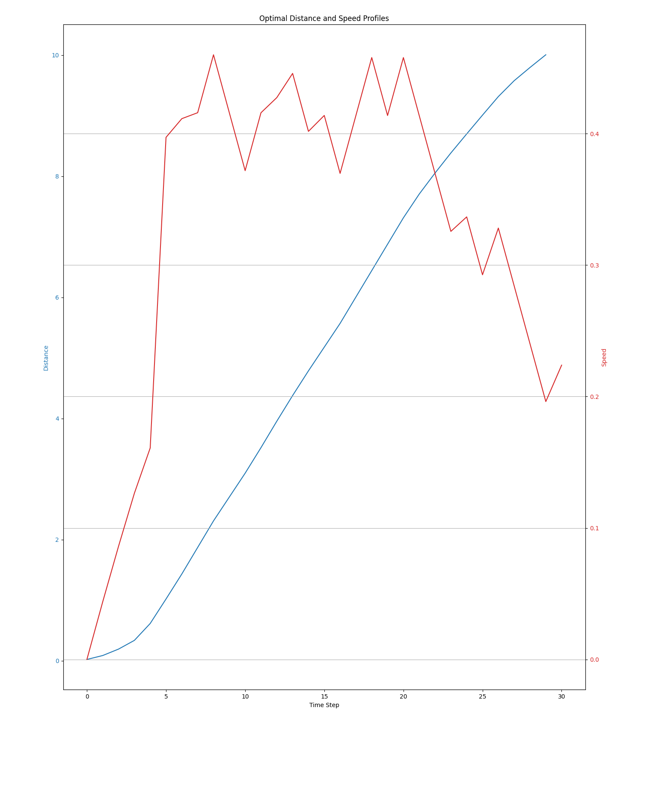

# The Travelling Salesman Problem (TSP):

## Description
The aim of solving the TSP is, given a map containing different cities, to find the shortest path to visit all cities and return to the initial city. We usually represent this problem by using a graph. Using this representation, the aim of this problem is to find the shortest path that traverses every vertex in the graph once.

Consider a rail network modeled as a weighted graph G=(V,E) where V represents the set of stations and E corresponds to the direct railway connections between them. The weight $w_{i,j}$ corresponds to the minimum energy required to go from node i to node j. We are therefore looking for the Hamiltonian cycle in G that minimises the energy expenditure.

This Hamiltonian cycle is represented as a $N\times N$ matrix M where:
```math
\forall i,j \ ; x_{i,j}=
\begin{cases}
1 & \text{if solution contains the} \ i^{th} \ \text{node in order j}. \\
0 & \text{if solution does not}
\end{cases}
```

## Common methods of resolution
Given the complex nature of the problem, exact solution are computationally unfeasable with classic algorithms. This is why, to solve this problem, we use heuristic and approximation algorithms such as Simulated Annealing or even Quantum Annealing and QAOA.

### Classical Resolution

### Simulated Annealing

#### Presentation of the Method

Simulated Annealing is a meta-heuristic technique designed to approximate a global solution in a large search space. The algorithm emplys a probabilistic solution selection critereon to avoid local optimisation. Superior solutions are accepted while inferior ones may be accepted based on a Boltzmann distribution:
```math
Probability= exp(- \frac{O_{i+1}-O_i}{T_{i+1}})
```
Where $O_i$ is the solution at step i and $T_{i+1}$ is determined by an annealing schedule.

#### Implementation
We first start with a set of points all at specific distance of each other :

We pass these points through the simulated annealing process and the brute resolution and compare the results:

We have, in green the brute solution that goes through all of the possibilites and in blue the solution found by simulated annealing.
The brute solution gives use a minimum distance of 144 whilst the SA method gives us a minimum of 174 which is pretty good considering the simplicity of my implementation.

### Quantum Resolution

In the same as for our optimal acceleration/deceleration problem we will use QAOA to translate our problem for it to be solvable by a quantum computer. The constraints on the Hamiltonian are:
```math
\sum_i x_{i,p} = 1 \ \forall p \\
\sum_p x_{i,p} = 1 \ \forall i
```
As a node can only be gone through once and only one node is visited at a specific step p.
We also have a penalty that applies when two nodes visited consecutively are not directly linked:
```math
\sum_{(i,j) \notin E} \sum_p x_{i,p} \times x_{j,p+1} > 0
```
Assuming we get back to the initial point at the end of the Hamiltonian, the cost function is given by:
```math
C(x)= \sum_{i,j} w_{i,j} \sum_p x_{i,p} x_{j,p+1}
```