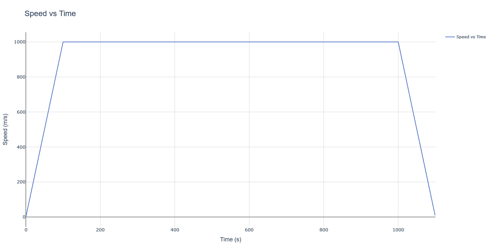

# Representing the train acceleration/decceleration optimisation problem

## Objective

The objective of the problem is to minimize the amount of energy used by a train to move from point A to point B. In order to do this we must figure the optimal time when the train should be accelerating, coasting or braking.

## First formulation

In order to do this we will model the train as being in one of three states during the trip.

- State 1: Acceleration where: $\vec{a}=a\times\vec{u}$ between t=0 and t=$t_{1}$
- State 2: Coasting where: $\vec{a}=0$ between t=$t_{1}$ and t=$t_{2}$
- State 3: Braking where: $\vec{a}= -a'$ between t=$t_{2}$ and t=T

In this model we have made a few hypothesis:

- There is no friction
- We do not require energy for braking
- There is no regenerative braking
- The efficiency ($\eta$) of the motors is constant

This gives us that:

```math

v(t) = 
\begin{cases} 
at & \text{for } 0 < t < t_1 \\ 
v_{\text{max}} & \text{for } t_1 < t < t_2 \\ 
v_{\text{max}} - (t - t_2) a' & \text{for } t_2 < t < T 
\end{cases}
```

From this we can determine that:
$$
E_{total} = E_{State 1} + E_{State 2} + E_{State 3} \\
And \ since\ : \ E_{State 2} = E_{State 3} = 0 \\
\Rightarrow  E_{total} = E_{State 1} \\
And \ : \ E_{State 1}=E(t_{1})-E(t=0) = E(t_{1})
$$
Considering only the cinetic energy, we need to minimize:
$$
E_{total} = \frac{\eta \times m \times v_{max}^2}{2}
$$
We will not consider the mass of the train in our problem as it is a constant.

## Converting the problem to a QUBO problem

### What are QUBO problems

The QUBO (Quadratic Unconstrained Binary Optimization) framework is a mathematical formulation used in optimization problems, particularly in quantum computing when the objective is to minimize a quadratic function of binary variables.

#### Particularities

1. **Quadratic Objective Function**: The objective function is expressed as a quadratic polynomial of the binary variables. It typically has the form:

```math
   f(x) = \sum_{i} a_i x_i + \sum_{i < j} b_{ij} x_i x_j
```

   Where:

- $a_{i}$ are linear coefficients
- $b_{ij}$ are quadratic coefficients
- $x_i$ are the binary variables.

2. **Unconstrained**: QUBO problems do not have explicit constraints on the variables, although constraints can often be embedded into the objective function.

### Converting our problem to QUBO

#### **Defining a solution**
We will be working with speed and not energy in order to simplify our problem. Firstly, we start by discretising our functions from $f(t)$ to $f_n$. We then consider our three states (as defined earlier) encoded into two bits $x_i$, where:

```math

v_{i+1} = 
\begin{cases} 
v_i & \text{if }  x_i=00 \\
v_i + \Delta v & \text{if }  x_i=01 \\
v_i - \Delta v & \text{if }  x_i=10 \\
v_i & \text{if }  x_i=11 \\
\end{cases}
```
Where $\Delta v = v_{i+1}-v_i$ 

We then consider a system with N discrete time-steps the $i^{th}$ time step having a corresponding two-bit decision variable $x_{i,a}$;$x_{i,b}$. 

 We consider a solution being an  $x\in \left\{00,01,10,11\right\} ^N$

#### **Defining the cost function**
We use a constant energy model, why hypothesises the fact that the energy needed to go from one speed to another is always constant. We also consider that the efficiency $\eta$ is proportional to the ratio of the average velocity (between initial and final speed) up to a constant C, ie. $\eta =C \times \frac{v_{avg,i}}{\Delta v_i}$.
And with:
```math
E_{i+1} = \frac{1}{2 \eta}  (v_{i+1}^2 - v_i^2) = \frac{1}{\eta} \Delta v_i \ v_{avg,i}
```

##### *Without braking regeneration*
Our cost function is:
```math
E(x)= \sum_{i=1}^{N} (\Delta v^2 \times x_{i,b})
```

##### *With braking regeneration*
Our cost function is:
```math
E(x)= \sum_{i=1}^{N} (\Delta v^2 \times x_{i,b} - \alpha\times\Delta v^2 \times x_{i,a})
```
Where $\alpha$ is the efficiency of the energy recuperation system.

#### **Converting the constraints**

As explained earlier, QUBO problems are unconstrained, we therefore have to turn constraints into penalties our resolution will heavily try to reduce.

##### *No simultaneous braking and acceleration*
Our train cannot accelerate and brake at the same time, we therefore apply a penalty when both our bits are 1.
```math
P_1= \lambda _1 \ \sum_{i=1}^{N}   x_{i,a} \times x_{i,b}
```
As we want to force that value towards 0.

##### *Distance constraint*
Another constraint we have to respect is that we have to have arrived at our destination, therefore having only gone through a distance of D.
```math
P_2= \lambda _2 \ [\sum_{i=1}^{N} ((N-i)\Delta v \times x_{i,a} - (N-i)\Delta v \times x_{i,b})-D] \ ^2
```
As we want to force our distance towards D.

##### *Net-Zero speed constraint*
Another constraint we have to respect is that we have to have stopped at our destination therefore braking as many times as we have accelerated.
```math
P_3= \lambda_3 \ [\sum_{i=1}^{N} (x_{i,a}-x_{i,b})] \ ^2
```
As we want to force that value towards 0.

##### *Maximum Speed Constraint*
The last contraint we have to respect is a maximum speed constraint.
```math
P_4= \lambda_4 \ [(\Delta v \times \sum_{i=1}^N x_{i,b}) - v_{max}]^2
```
**Where $\lambda _i$ are multipliers used to accentuate the importance of these penalties.**

### The final QUBO problem

We want to minimise:
```math
E(x)= \Delta v^2 \sum_{i=1}^{N} ( x_{i,a} - \alpha \ x_{i,b}) +  \lambda _1\sum_{i=1}^{N}   x_{i,a} \times x_{i,b} + \lambda _2 \ [\sum_{i=1}^{N} ((N-i)\Delta v \times x_{i,a} - (N-i)\Delta v \times x_{i,b})-D] \ ^2 +\lambda_3 \ [\sum_{i=1}^{N} (x_{i,a}-x_{i,b})] \ ^2 + \lambda_4 [(\Delta v \sum_{i=1}^N x_{i,b}) - v_{max}]^2
```